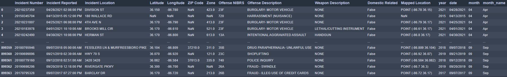
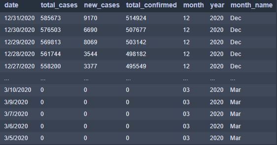
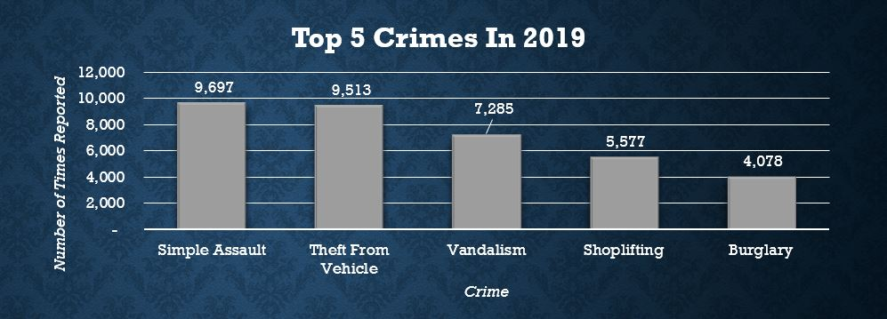
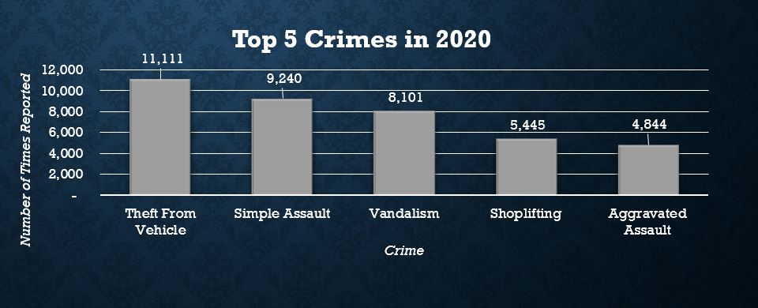
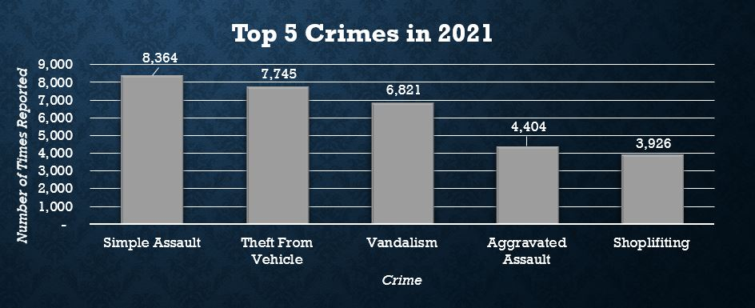
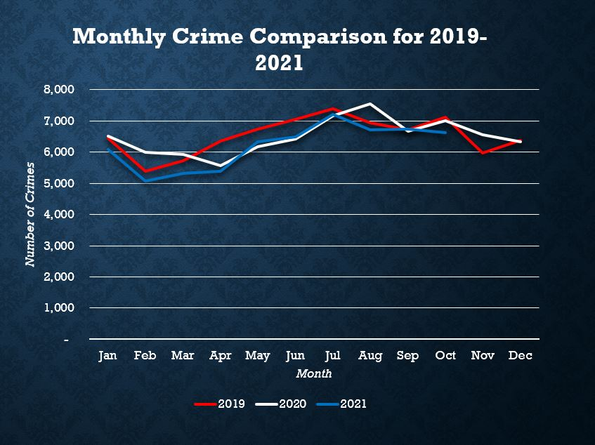

# Nashville Crime: Pre-Covid, Covid, & Now
## *How has the emergence and continued presence of Covid-19 shaped crime statistics in Nashville-Davidson County?*
This is the foundational question for my Capstone Project.  Covid-19 has forced upon humanity an immeasurable paradigm shift; from the way people socially interact, the way business is conducted, how our children attend school, and how we make a living have all been altered.  I want to know how has that shift affected crime?

## My Motivation
Prior to enrolling in the full-time Data Analytics program at Nashville Software School, I served as an officer and detective for the Metropolitan Nashville Police Department (MNPD) from October 2009 to July of 2021.  In those nearly 12 years, I responded to thousands of calls for service and conducted hundreds of investigations into all manner of crime.  Also, I learned that crime, in general, followed certain patterns.  For example, when summer arrived and the days and nights were hot, work was going to get busy; by that I mean the amount of crime was going to increase and so to would calls for service.  Also, when kids were out of school for various breaks, certain crimes were going to spike.  It was just a foregone conclusion.

With the arrival of the virus, normal life was turned upside down.  Working from home was/is now the norm and via Zoom became the way children attended school. I became curious how crime adapted to the new way of life.  Although I was present for that change, I never looked into the actual numbers to see how crimes evolved.  There were certain assumptions I made, but those were based upon gut feelings and personal observations, not from diving into the data.  Given that more people are working from home, I assumed that the number of residential burglaries decreased; burglars don't want to encounter people when trying to break into a house.  Also, I assumed that more people working from home caused the number of domestic-related crimes to increase.  With constant interaction between spouses, family members, roommates, etc., it seemed only rational that friction between them would increase since they were not accustomed to being around each other all the time.  With that, I decided to dive into the Nashville-Davidson County crime statistics to see if my assumptions were correct, and what other changes (if any) arose.

## Acquiring The Data
I began by pulling the incident report data kept by the MNPD.  For the uninitiated, an incident report is a document filled out by a responding officer that lists the occurrence of the crime or incident to which the officer is responding.  This report contains all types of pertinent data to include, but not limited to time, place, victim and suspect demographic information, victim's relationship to the suspect (if any), was a weapon, and dozens of other criteria that may or may not be applicable to the event.  I decided to use the incident report data from 2019 to serve as my pre-Covid crime baseline, the 2020 data is obviously the during Covid-19 data, and the MNPD data for 2021 was used for the 'moving forward' data to see if and how crime shifts now that life with Covid-19 is becoming it's normal.  Of note, when I pulled the data to begin working on this project the MNPD only had incident report data until mid-November.
For Covid-19 statistics, I utilized the State of Tennessee data for all known Covid-19 cases beginning in March of 2020 through early December of 2021.

**Metro Nashville Police Department Incidents**: https://data.nashville.gov/Police/Metro-Nashville-Police-Department-Incidents/2u6v-ujjs

**Covid-19 Data**: https://www.tn.gov/content/dam/tn/health/documents/cedep/novel-coronavirus/datasets/Public-Dataset-Daily-Case-Info.XLSX

## Data Cleaning
Upon acquiring the MNPD dataset, I discovered the CSV file contained nearly nine hundred thousand rows with each row representing an individual report taken, with some dating back to 2014.  The data frame consisted of 31 columns with each column representing a specific question answered by the incident report.  I uploaded the MNPD CSV file into Python to conduct the cleaning.  As I first began looking at and manipulating the data, I initially discovered that the most commonly taken report was "Matter of Record".  From my previous experience, I knew these reports represented incidents that did not involve any crime taking place.  A matter of record report is used to document when two individuals may have been arguing, but no crime occurred; additionally it is used to document when a parent or guardian failed to abide by a civil court order (such as a child custody agreement).  This too is not a crime, however, parents/guardians routinely ask for such incidents to be documented so they can be presented during future court custody proceedings.  Additionally, reports like lost and found property were also present in the data frame.  Because I was solely focusing on crime statistics, I decided to remove any row that contained a report that was not specifically reporting a crime occurred.

To better understand the columns and what each represents, I recommend following the link: [Explanation Columns in Dataset](https://data.nashville.gov/api/views/2u6v-ujjs/files/4537ce42-a1d7-4157-be45-6ab2f22c15ef?download=true&filename=Metro-Nashville-Police-Department-Incidents-Metadata-v2.pdf).

The State of Tennessee Covid-19 dataset was, by-and-large, clean and actually needed very little cleaning to make the data useable.  The majority of the work was removing and creating columns so I could more easily join the crime and Covid data frames together.

## Analysis
The first task I undertook was to see which crimes occur most often and which months have the highest reported occurrences of crime.  I used those two metrics throughout the analysis to use as a visualization of change in crime throughout the three years I analyzed.  
### *Top 5 Crimes*

### *Changes in Crime From 2019-2021*

Also, during the analysis I wanted to see how Covid-19 numbers changed from 2020 to 2021.  Thinking the two years would have similar monthly trends, I was surprised by the findings.
### *Covid-19 Month-To-Month Comparison*

## Summary
Throughout this process, I found myself constantly amazed at both the variation and lack of variation in Nashville's crime trends since 2019.  Although there seems to be some consistency in which crimes are most often perpetrated, there appears to have been a significant increase in the amount of violent crime that has occurred.  Additionally, an unintended discovery was how the fluctuation of Covid-19 cases appear to have no discernable pattern from 2020 to 2021.  Overall, I found thoroughly enjoyed my this project and the analysis of these two sets of data and am curious to see how the two continue to evolve as the time passes.
